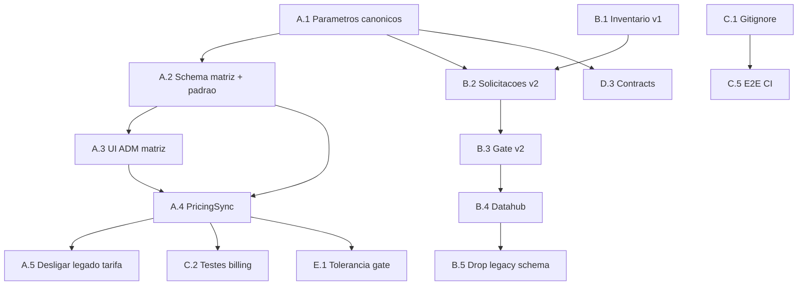

# Programa de Melhorias — RL Transportes

**Versão:** 1.1 · **Atualizado:** 2026-07-29  
**Status:** Aprovado (DP-1/2/3 + regras complementares de pricing)

---

## Decisões registradas

| DP | Decisão |
|----|---------|
| **DP-1 Pricing** | **Opção A** — Cadastro ADM → sync billing. Matriz **Tipo × Capacidade (HC/DC) × Tamanho × Status** → **Handling único** + **free time**. **Diária escalonada por faixas de dias** (não valor fixo por célula). Tabela **padrão** + **comerciais**; cliente no cadastro. **Vigência:** ativo/inativo (editável). |
| **DP-2 Sunset v1** | **Remover v1** — usar v2 ou complementar; eliminar redundâncias. Sem prazo externo de go-live; operação local. |
| **DP-3 Capacidade** | Desenvolvimento iterativo (sem deadline de produção). |

---

## Visão de produto — Pricing (DP-1)

### O que o ADM configura

No menu **Administração / Financeiro → Tabelas de preços**:

1. **Tabela padrão do terminal** (`padrao = true`)
   - Vale para **todos os clientes** que não tenham tabela comercial atribuída.
   - Apenas **uma** tabela padrão ativa por tenant.

2. **Tabelas comerciais** (`padrao = false`, opcional `clienteId` ou vínculo via cadastro cliente)
   - Negociações específicas; **substituem** a padrão para o cliente vinculado.

3. **Matriz de itens** — para cada combinação válida:

   | Dimensão | Fonte canônica | Exemplos / notas |
   |----------|----------------|------------------|
   | **Tipo** | MDM → Tipos de contêiner | **DRY** (latão), Reefer, Open Top… — *não* confundir com HC/DC |
   | **Capacidade** | MDM → Capacidades | **HC** (High Cube), **DC** (Dry Container / altura padrão) |
   | **Tamanho** | MDM → Tamanhos | 20′, 40′, 45′ |
   | **Status** | Parâmetros | Cheio, Vazio |

   **Por célula da matriz (Tipo × Capacidade × Tamanho × Status):**
   - `valorHandling` — **uma taxa única** que cobre **gate-in + gate-out** (não valores separados)
   - `freeTimeDias` — dias gratuitos (ex.: 7 = dia da chegada + 6 dias)

   **Por tabela (ou por célula — ver nota abaixo):**
   - **Faixas de diária** — escalonamento pós free time (ver exemplo)

4. **Diária escalonada (faixas de permanência)**

   Exemplo (tabela padrão, free time 7 dias, estadia 18 dias):

   | Dias de permanência (corridos) | Tarifa/dia |
   |--------------------------------|------------|
   | 1–7 | R$ 0 (free time) |
   | 8–15 | R$ 30,00 |
   | 16+ | R$ 45,00 |

   Total diárias cobráveis: (8 dias × 30) + (3 dias × 45) = R$ 375,00 (+ handling + reefer se houver).

   Configurável no ADM como **faixas** ligadas à tabela (default) ou à célula da matriz quando negociação exigir.

5. **Vigência**
   - **Ativo / inativo** — suficiente; tabelas podem ser editadas sem obrigar `dataInicio`/`dataFim`.
   - Campos de vigência existentes permanecem opcionais para uso futuro.

6. **Cadastro do cliente**
   - Campo **Tabela de preços** (dropdown: Padrão | Tabela X | Tabela Y).
   - Default ao criar cliente: **Padrão**.
   - Persistência: `cliente.tabelaPrecoId` → `TabelaPreco` (billing runtime).

### Fluxo técnico (sync)

```
[UI Cadastro Tabela] → [CadastroTabelaPreco + Itens matriz]
        ↓ on save
[PricingSyncService] → upsert TabelaPreco + RegraTarifaria[]
        ↓
[BillingRuleEngine] → gate-in/out, provisão diária, gate-out
```

### Resolução em runtime

```
resolveTabelaCliente(clienteId):
  1. se cliente.tabelaPrecoId → usa essa TabelaPreco
  2. senão → TabelaPreco onde padrao=true AND tenantId AND ativa
  3. senão → erro explícito (não DEFAULT silencioso)
```

---

## Workstream A — Pricing unificado (P0)

Ordem de execução recomendada.

### A.1 Parâmetros canônicos (fundamento)

**Objetivo:** Tipo, Tamanho e Status usados **em todo o sistema** vêm dos mesmos cadastros.

| Entrega | Descrição |
|---------|-----------|
| A.1.1 | **Tipos de contêiner** — `CadastroTipoContainer`: DRY, REEFER, OT… (material/construção); **não** incluir HC/DC como tipo |
| A.1.2 | **Capacidades** — novo catálogo MDM `CadastroCapacidadeContainer`: HC, DC (+ seed); usado na matriz e no portal |
| A.1.3 | **Tamanhos** — catálogo tenant (`20'`, `40'`, `45'`) |
| A.1.4 | **Status** — enum `CHEIO` / `VAZIO`; lista fechada nos parametros |
| A.1.5 | **Contrato compartilhado** — tipos: `ContainerTipo`, `ContainerCapacidade`, `ContainerTamanho`, `StatusContainer` |
| A.1.6 | Refatorar portal, gate, billing → lookup por codigos MDM (sem heuristica IMO/REEFER) |

**Critério de aceite:** criar solicitação portal só aceita tipo/tamanho/status existentes nos parametros.

### A.2 Modelo de dados — tabela padrão + matriz

| Entrega | Schema / migration |
|---------|-------------------|
| A.2.1 | `CadastroTabelaPreco.padrao Boolean`; `ativo Boolean` (vigência = ativo/inativo) |
| A.2.2 | `CadastroTabelaPrecoItem`: `tipoContainerCodigo`, `capacidadeCodigo`, `containerTamanho`, `statusContainer`, `valorHandling`, `freeTimeDias` |
| A.2.3 | **`CadastroTabelaPrecoFaixaDiaria`** (ou JSONB validado): `tabelaId`, `itemId?`, `diaInicio`, `diaFim?`, `valorDiaria` |
| A.2.4 | `TabelaPreco.padrao`, `cadastroTabelaId`; sync link |
| A.2.5 | Billing: **`FaixaDiariaCalculator`** — substitui `dias × valorUnitario` fixo |
| A.2.6 | `RegraTarifaria` / JSONB `faixasDiaria` espelhando cadastro após sync |
| A.2.7 | Handling runtime: evento **`HANDLING`** (valor cheio no gate-out) *ou* `GATE_IN` com valor + `GATE_OUT` zerado |
| A.2.8 | Deprecar `TabelaTarifaria` |

**ADR:** `docs/adr/004-pricing-unificado.md`

### A.3 UI ADM — matriz de preços

| Entrega | Tela |
|---------|------|
| A.3.1 | Toggle **「Tabela padrão do terminal」** no form (desliga em tabelas comerciais) |
| A.3.2 | Grid: Tipo × Capacidade × Tamanho × Status → handling + free time |
| A.3.3 | Editor de **faixas de diária** (tabela-level; override por célula opcional fase 2) |
| A.3.4 | Botão gerar combinações a partir do MDM |
| A.3.5 | Indicador sync billing |
| A.3.6 | Cadastro cliente — select tabela de preços |

### A.4 PricingSyncService

| Entrega | Detalhe |
|---------|---------|
| A.4.1 | Módulo `pricing-sync/` — `syncFromCadastro(tabelaId)` |
| A.4.2 | Sync handling → 1 regra `HANDLING` (ou GATE_IN único); faixas → JSONB/`FaixaDiaria` no engine |
| A.4.3 | Hook create/update em `CadastrosTabelasPrecosService` |
| A.4.4 | `calcularDiariasEscalonadas(diasPermanencia, freeTime, faixas)` + testes exemplo 7/18 dias |
| A.4.5 | Atribuição cliente: update `cliente.tabelaPrecoId` ao vincular tabela comercial |
| A.4.6 | Audit log categoria FINANCEIRO |
| A.4.7 | Script `migrate-tabela-tarifaria-to-regras.ts` |

**Testes:** faixas (7 free + 18 dias = 375), handling cobrado uma vez, sync tabela padrão vs comercial.

### A.6 Algoritmo diária escalonada (referência)

```typescript
// diasPermanencia: dias corridos no pátio (PR-02)
// freeTimeDias: ex. 7 → dias 1..7 isentos
// faixas: [{ diaInicio: 8, diaFim: 15, valor: 30 }, { diaInicio: 16, diaFim: null, valor: 45 }]
function calcularArmazenagemEscalonada(diasPermanencia, freeTimeDias, faixas): number {
  let total = 0;
  for (let d = freeTimeDias + 1; d <= diasPermanencia; d++) {
    const faixa = faixas.find(f => d >= f.diaInicio && (f.diaFim == null || d <= f.diaFim));
    total += faixa?.valor ?? 0;
  }
  return total;
}
```

### A.5 Desligar legado

- [ ] Seed só cria tabela padrão + regras sync
- [ ] Remover fallback `TabelaTarifaria` em `resolvePricingForCliente`
- [ ] Migration arquivar `tabelas_tarifarias` (read-only → drop)

---

## Workstream B — Sunset v1 / v2 only (P0)

**Princípio:** zero writes em v1; read-only temporário só se houver dados históricos locais.

### B.1 Inventário (T0)

**Entregável:** `docs/adr/003-inventario-v1.md`

- Listar módulos `solicitacoes/` (v1), gate legacy, patios legacy
- Listar rotas frontend `/staff`, APIs consumidas
- Listar MVs Datahub com UNION

### B.2 Solicitações — v2 only

| # | Ação |
|---|------|
| B.2.1 | Portal e intranet: **só** `solicitacoes-v2` |
| B.2.2 | Endpoints v1 → 410 Gone ou proxy fino para v2 |
| B.2.3 | Remover `SolicitacoesModule` v1 do `PlatformModule` quando proxy ok |
| B.2.4 | E2E portal: criar solicitação → assert stack v2 |

### B.3 Gate / pátio — v2 only

| # | Ação |
|---|------|
| B.3.1 | Operador cockpit **só** APIs gate-v2 / patio_v2 |
| B.3.2 | `LEGACY_GATE_WRITE=0` default |
| B.3.3 | Remover componentes UI legacy gate |
| B.3.4 | E2E operador gate-checkin no CI |

### B.4 Datahub / BI

| # | Ação |
|---|------|
| B.4.1 | Refatorar MVs — origem só v2 |
| B.4.2 | Remover UNION legacy |

### B.5 Limpeza schema (fase final)

| # | Ação |
|---|------|
| B.5.1 | Migration drop ou rename `_legacy` tabelas sem FK ativo |
| B.5.2 | Remover código morto (grep `solicitacoes.service` v1, etc.) |

**Critério de aceite:** `npm run ci:test` verde; zero imports de módulos v1 no app.module.

---

## Workstream C — Qualidade e CI (P1)

Sem prazo fixo; executar em paralelo após A.1.

| # | Entrega |
|---|---------|
| C.1 | `.gitignore` credenciais + template example |
| C.2 | `billing-rule-engine.service.spec.ts` — resolução tabela padrão vs cliente |
| C.3 | Specs cadastros: tabelas-precos, tipos-container |
| C.4 | Vitest web — utils portal/gate |
| C.5 | CI job e2e **real** (postgres + backend + 6 specs) |
| C.6 | Coverage billing-engine ≥ 70% |

---

## Workstream D — Refatoração e DX (P2)

| # | Entrega | Prioridade |
|---|---------|------------|
| D.1 | Extrair sub-serviços `gate.service.ts` | Após B.3 |
| D.2 | Extrair `solicitacoes-v2.service.ts` | Média |
| D.3 | npm workspaces + `@rl/contracts` | Após A.1.4 |
| D.4 | Merge `observabilidade` / `observability` | Baixa |
| D.5 | README architecture + diagrama | Contínuo |
| D.6 | `doctor` — migrate pending, prisma generate | Baixa |

---

## Workstream E — Produto operacional (P1/P2)

Completar loops do terminal (PDF Glaucio + parametros).

| # | Entrega |
|---|---------|
| E.1 | PR-05 — tolerância chegada no gate |
| E.2 | PR-09 — atendimento especial + audit JSON |
| E.3 | KPIs cockpit — TAT/SLA em minutos (tenant) |
| E.4 | Demo modules off por default em build prod |

---

## Ordem de execução (sem datas — dependências)



**Sugestão de sequência para o agente dev:**
1. A.1 → A.2 → A.4 (sync mínimo) → A.3 (UI matriz) → C.1/C.2  
2. B.1 → B.2 → B.3  
3. A.5 → B.4 → B.5  
4. C.3–C.6, D.*, E.*

---

## Definition of Done (programa)

- [ ] Uma tabela **padrão** configurável; clientes novos usam padrão; comercial override no cadastro cliente
- [ ] Matriz **Tipo × Tamanho × Status** com handling + free time + diária; sync → billing
- [ ] Tipos/tamanhos/status **parametrizados** e reused portal + gate + billing
- [ ] **Zero** writes v1; código v1 removido ou arquivado
- [ ] `TabelaTarifaria` legado desligado
- [ ] CI: e2e real + billing service testado
- [ ] Credenciais fora do git

---

## Decisões complementares (2026-07-29)

| Tópico | Decisão |
|--------|---------|
| **Handling** | **Um valor** por combinação, cobrindo **entrada + saída** juntas |
| **DRY / HC / DC** | **DRY** = tipo (latão); **HC** e **DC** = **capacidade** (dimensão separada do tipo) |
| **Diária** | **Escalonada por faixas de dias** após free time — **não** valor fixo único por célula hoje |
| **Vigência** | **Ativo/inativo**; tabelas editáveis |

### Pergunta em aberto (opcional)

As **faixas de diária** são **iguais para toda a tabela** (padrão do terminal) ou podem **variar por célula** (Tipo×Capacidade×Tamanho×Status) em tabelas comerciais?  
*Plano v1.1: faixas no nível da **tabela**; override por célula na fase 2 se necessário.*

---

## Referências

- [ADR 003 — v2 sunset](../adr/003-v2-deprecation.md)
- [ADR 004 — pricing unificado](../adr/004-pricing-unificado.md) *(a criar)*
- [BILLING-MATRIX.md](../BILLING-MATRIX.md)
- Sprint 1 billing: `billing-sprint1.spec.ts`, migrations `20260728140000`, `20260728150000`
